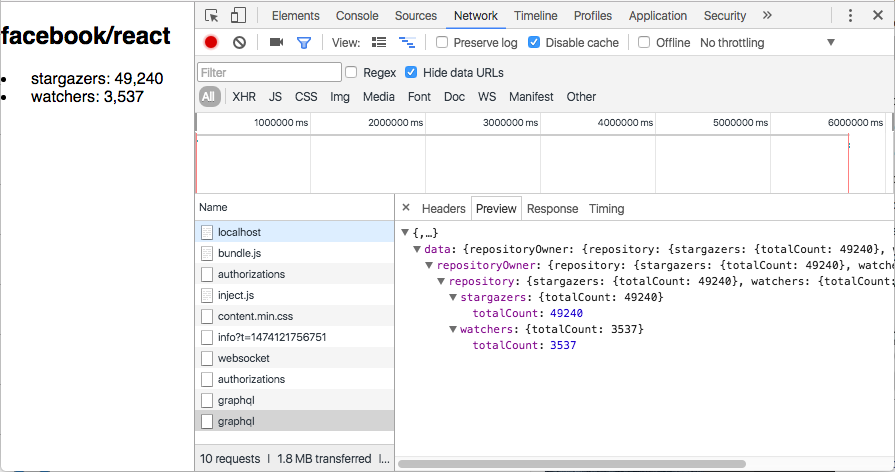

# react-apollo-graphql-github-example
Apollo React example for Github GraphQL API with [create-react-app](https://github.com/facebookincubator/create-react-app)



## Prerequisites
- git
- nodejs
- Github app and credential [GITHUB_CLIENT_ID,GITHUB_CLIENT_SECRET](https://developer.github.com/v3/guides/basics-of-authentication/#accepting-user-authorization)
- [Integrations Early Access](https://developer.github.com/changes/2016-09-14-Integrations-Early-Access/)

## Install
```sh
git clone https://github.com/katopz/react-apollo-graphql-github-example.git
cd react-apollo-graphql-github-example
npm i
```

## Config
- Copy `config.default.js` into a file called `config.js`, and replace `xxx` with your username and password
- Replace `GITHUB_CLIENT_ID` and `GITHUB_CLIENT_SECRET` with your credential.

## Develop
```sh
npm start
```
> For `VSCode` you can press `F5` to run :)

## More examples
- [Search for top ten stargazers](https://gist.github.com/katopz/2729ace879e3576e8da9292cc8433673)
- [Search for top ten stargazers via query](https://gist.github.com/katopz/7441f90696b3586f8ec2d673b88dc4be)

## Referer
- [create-react-app](https://github.com/facebookincubator/create-react-app)
- [The new GitHub GraphQL API](https://medium.com/apollo-stack/the-new-github-graphql-api-811b005d1b6e#.lcm2mmtn2)
- [Github GraphQL API React Example](https://medium.com/@katopz/github-graphql-api-react-example-eace824d7b61#.fil01xjsl)
- [🔍 How to search with Github GraphQL](https://medium.com/@katopz/how-to-search-with-github-graphql-e6c142dc61ed)